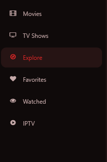
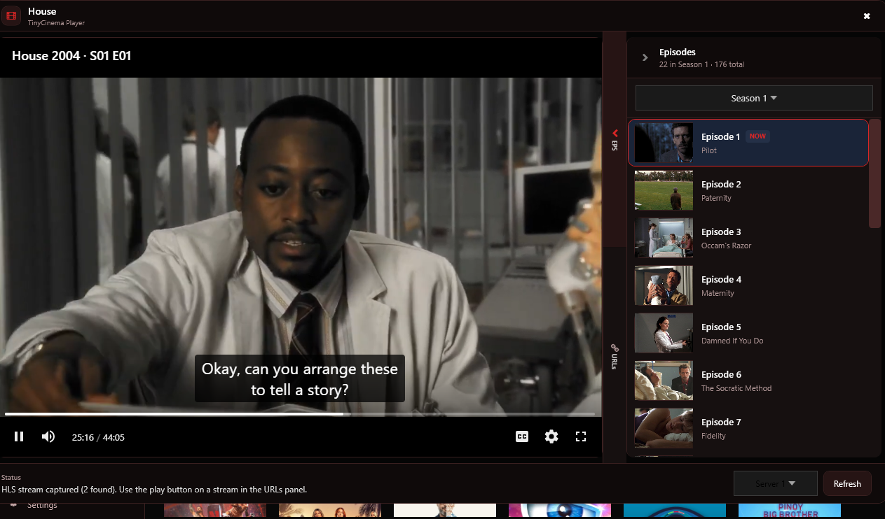
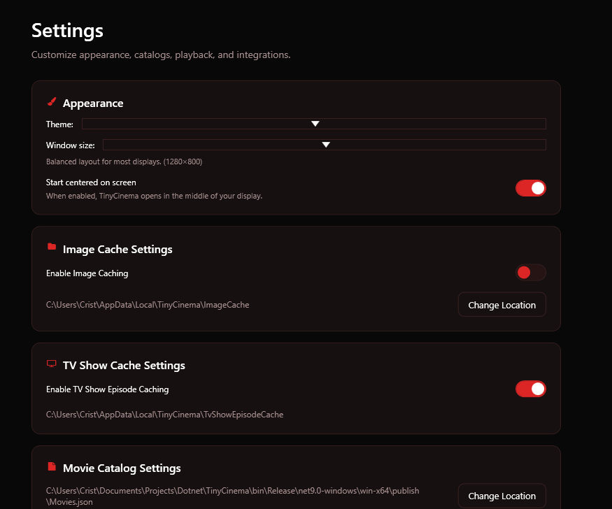

# TinyCinema

Desktop app for browsing, organizing, and watching movies and TV shows from your personal catalog.


## Requirements

- **Windows** (Mac support planned)
- [WebView2 Runtime](https://developer.microsoft.com/en-us/microsoft-edge/webview2/) — required for the built-in player
- **TMDB API key** — required for trailers, metadata, and recommendations. [Create a free TMDB account](https://www.themoviedb.org/signup), then copy your API key from [API Settings](https://www.themoviedb.org/settings/api) and paste it into TinyCinema **Settings**.
- **FFmpeg** — required for downloads
- Optional external players: **VLC**, **FFPLAY** (FFmpeg), or **TinyPlayer**

## Download Latest or Build

**Download** — Get the latest Windows build from the project **Releases** page (when available).

**Build from source** — Clone the repo, install the [Requirements](#requirements), then use one of the options below.

### Run (development)

```bash
dotnet run
```

### Build (release)

```bash
dotnet publish -c Release
```

Output is a self-contained Windows executable in `bin/Release/net9.0-windows/win-x64/publish/`.
---

## Getting Started

When you first open TinyCinema, movies and TV shows are loaded from `Movies.json` and `tv_show_links.txt`. The included files should give you a solid catalog to start with. You can change the paths for both files in **Settings**.

## Sidebar



The left sidebar is how you move around the app. Each tab focuses on a different view of your catalog:

| Tab | What it does |
|-----|----------------|
| **Movies** | Browse your movie catalog as a poster grid. Use search, genre, and country filters to narrow results. |
| **TV Shows** | Same browsing experience, filtered to TV series only. Pick a show to view seasons and episodes in the player. |
| **Explore** | Personalized home screen with recommendation rows based on what you’ve watched and favorited. |
| **IPTV** | Live TV channels organized by category. Browse channels and open a stream in the player. |
| **Favorites** | Titles you’ve hearted, in one place for quick access. |
| **Watched** | Your watch history — titles marked with the eye icon. Filter by movies, TV shows, or both. |

Select a title in any tab to see details in the hero panel, then play it from there.

## Player



The built-in player opens when you hit **Play** on a title. It uses WebView2 to load streaming sites and can capture HLS (`.m3u8`) stream URLs for external playback or download.

### Shared features (movies & TV)

- **In-app browser** — Loads the watch page inside the player window.
- **URLs panel** — Side tab that lists captured network URLs. Search, filter to HLS only, pause capture, copy links, open streams in your default external player, download with FFmpeg, or send to Roku.
- **Status bar** — Shows what the player is doing (loading, resolving embed, capturing streams).
- **Refresh** — Reloads the current page.
- **Ad/popup blocking** — When enabled in Settings, blocks popups and known ad/tracker requests.

External players (VLC, FFPLAY, TinyPlayer) launch from the URLs panel when you click play on a captured HLS stream. Your default player is set in **Settings → Default Player**.

### Movies

- **Source: TinyZone or MovieLair** — Footer dropdown to switch where the movie loads from.
- **Cinema mode** — Hides page clutter and focuses on the video player (TinyZone only). Auto-selects Server 1 and tries to start playback.
- **Stream capture** — Listens for HLS URLs while the page loads so you can open them externally or download.

### TV shows

TV playback uses **MovieLair** only.

- **Episode list** — Side panel with season filter, episode thumbnails, and a **NOW** badge on the current episode.
- **Resume** — If you open a show from **Watched**, it picks up at your last season/episode.
- **Server selector** — Footer dropdown (Server 1–5) for MovieLair’s embed servers. Changing server reloads the current episode.
- **Embed resolution** — Loads the episode page, picks the selected server, then finds and navigates to the embed player. Falls back to playing on the MovieLair page if needed.
- **Episode cache** — Season/episode lists are cached (when enabled in Settings) so repeat visits load faster.

## Settings



Open **Settings** from the sidebar to configure the app. Changes save automatically.

### Appearance

- **Theme** — Switches the app color scheme (e.g. Black, Dark Blue).
- **Window size** — Preset window dimensions (Standard, Compact, etc.).
- **Start centered on screen** — Opens TinyCinema in the middle of your display when enabled.

### Image Cache

- **Enable Image Caching** — Saves poster and artwork locally so grids load faster on repeat visits.
- **Change Location** — Folder where cached images are stored.

### TV Show Cache

- **Enable TV Show Episode Caching** — Stores scraped season/episode lists so TV show pages load faster next time.

### Movie Catalog

- **Change Location** — Path to your `Movies.json` catalog file.
- **Fetch Movies from TinyZone** — Scrape and add movies from a TinyZone category into your catalog.
- **Add Movie by URL** — Add a single movie link to the catalog.
- **Build Smart Search Index** — Builds a local AI search index for plot, cast, and director search.

### TV Show Links

- **Change Location** — Path to your `tv_show_links.txt` file.
- **Fetch TV Shows from MovieLair** — Scrape TV shows from a MovieLair category into your links file.
- **Add TV Show by URL** — Add a single TV show link to the catalog.

### Player

- **Default Player** — In-app browser, TinyPlayer, FFPLAY, or VLC (if installed). External players launch when an m3u8 stream is captured.
- **Block Popups and Ads** — Blocks popups/new tabs and cancels known ad/tracker requests in the built-in player.
- **Blocked Ad / Tracker Hosts** — Extra domains to block (one per line). Used when popup/ad blocking is on. Reopen the player after editing.
- **Clear Player Browser Data on Close** — Wipes in-app browser cache when you close the player. Saves disk space; sites may load slower next time.
- **MovieLair Probe Logging** — Debug logging for TV playback (iframe, storage, video state) to `%TEMP%\TinyCinema\ProbeLogs`.
- **Embed Player Hosts** — Extra embed domains for TV playback (one per line). Built-in hosts are always included.

### TMDB

- **API Key** — Your TMDB key for trailers, metadata, and recommendations.

### Roku Sideload

- **IP Address / Username / Password** — Credentials for sideloading the TinyCinema channel to a Roku in Developer Mode (defaults: `rokudev` / `rokudev`).
- From the player, click the TV icon on an HLS stream to build, upload, install, and launch the channel automatically. If automatic upload fails, TinyCinema falls back to opening the zip and Roku installer page for manual upload.
